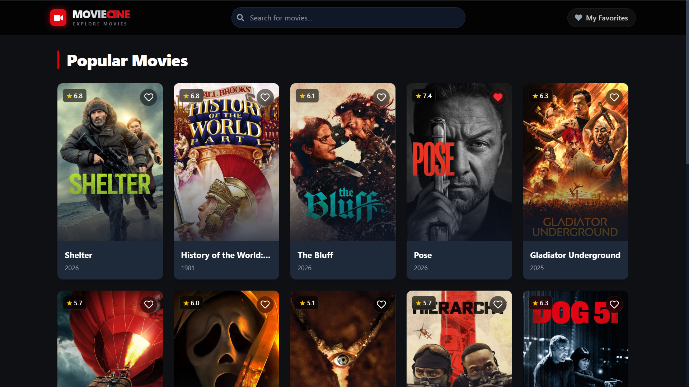

# 🎬 Movie-Cine

Movie-Cine is a highly optimized, responsive Netflix-lite movie discovery application powered by the **TMDB (The Movie Database) API**. It is built using modern **React hooks, Vite, and Tailwind CSS v4**.

### 🌐 Live Demo: [https://movie-cine-three.vercel.app/](https://movie-cine-three.vercel.app/)


# Screenshot:

 <!-- Replace with actual screenshot when hosted -->


---

## ✨ Features

### 🚀 Core Foundations

- **TMDB API Integration**: Dynamically fetches the "Popular Movies" and handles complex query searches.
- **Modern Cinematic UI**: Beautiful, grid-based aesthetic pulling inspiration directly from Netflix's premium dark mode, utilizing Tailwind CSS glassmorphism, gradients, and custom scrollbars.
- **Search Functionality**: A responsive navigation bar to instantaneously look up millions of titles.

### ⚡ Performance Mastery)

- **Infinite Scrolling API**: Replaces tedious pagination buttons. Powered by the React `IntersectionObserver` API, Movie-Cine intelligently loads the next "page" of 20 movies automatically the moment you scroll to the bottom of your screen to prevent crashing the DOM.
- **Search Debouncing**: Custom `useDebounce` hook waits exactly `500ms` after you finish typing before triggering the TMDB Search API—saving hundreds of wasted bandwidth-heavy network requests!
- **Favorites & LocalStorage**: Easily "Heart" any movie card. Movie-Cine saves your selections offline inside your browser's persistent `Local Storage`.
- **Netflix-Style Video Player**: Clicking a movie triggers an immersive, full-screen React Portal modal containing the movie's cinematic trailer seamlessly embedded from YouTube (supporting international/Bollywood movie tags!), alongside deep-details like ratings, runtimes, cast, and genres.

---

## 🛠️ Tech Stack

- **Frontend Library:** React JS (v19)
- **Build Tool:** Vite
- **Styling:** Tailwind CSS (v4)
- **Routing:** React Router v7 (`react-router-dom`)
- **Icons:** React Icons (`react-icons/fa`)
- **Data Source:** TMDB API via standard Fetch API

---

## 💻 Getting Started Locally

1. **Clone the repository** (or download the files).
2. **Install dependency packages**:
   ```bash
   npm install
   ```
3. **Get a Free TMDB API Key**:
   - Sign up at [The Movie Database (TMDB)](https://www.themoviedb.org/).
   - Navigate to Settings > API, and register to receive an API Key.
4. **Environment Variables Configs**:
   - Inside the root folder, create a file precisely named `.env.local`
   - Add your secret key using the Vite prefix:
   ```env
   VITE_TMDB_API_KEY=insert_your_actual_key_here
   ```
5. **Start the Development Server**:
   ```bash
   npm run dev
   ```
   (Open `http://localhost:5173` to view it in the browser)

---

## 🌐 Vercel Deployment

This project contains a `vercel.json` file natively pre-configured for Single Page Application (SPA) routing, meaning it is 100% ready to drop onto Vercel!

1. Upload the folder to your GitHub repository.
2. Sign in to [Vercel](https://vercel.com/) and click **Add New Project**.
3. Import your GitHub repository.
4. Open the **Environment Variables** section on Vercel and add:
   - `VITE_TMDB_API_KEY` (Paste the same key from your local file).
5. Click **Deploy!**

---

_Mission Completed - Built for the Ultimate Performance!_ 🍿
